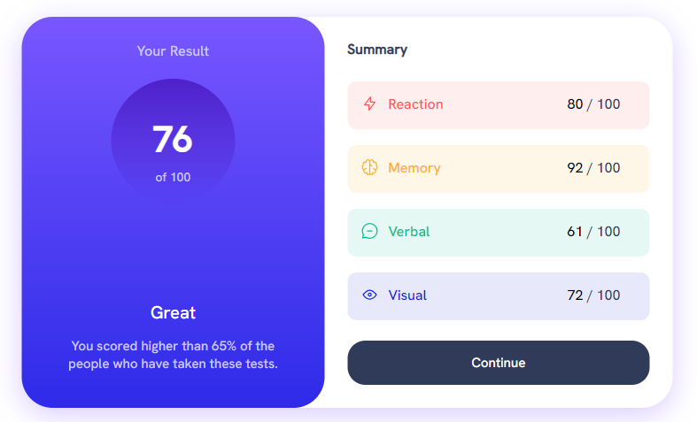
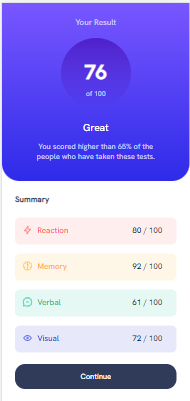

# Frontend Mentor - QR code component solution

This is a solution to the [QR code component challenge on Frontend Mentor](https://www.frontendmentor.io/challenges/qr-code-component-iux_sIO_H). Frontend Mentor challenges help you improve your coding skills by building realistic projects. 

## Table of contents

- [Overview](#overview)
  - [Screenshot](#screenshot)
  - [Links](#links)
- [My process](#my-process)
  - [Built with](#built-with)
  - [What I learned](#what-i-learned)
  - [Continued development](#continued-development)
- [Author](#author)


## Overview

### Screenshot




### Links

- Solution URL: 
- Live Site URL:
## My process

### Built with

- Semantic HTML5 markup
- CSS custom properties
- google fonts


### What I learned


```css
@media only screen and (min-width: 592px) and (max-width: 1440px) {
    .container {
        flex-direction: row;
        position: absolute;
        width: min(735px, 100%);
        top: 50%;
        left: 50%;
        height: 442px;
        transform: translate(-50%, -50%);
        border-radius: 35px;
        box-shadow: 0 8px 32px 0 var(--shdl);
    }
    .head {
        flex: 50%;
        height: 100%;
        border-radius: 35px;
    }
    .summary {
        flex: 50%;
    }
} 
```
### Continued development

maybe the next time i can try, grid or another flex responsive...


## Author

my name is: ilyas oufaraji
